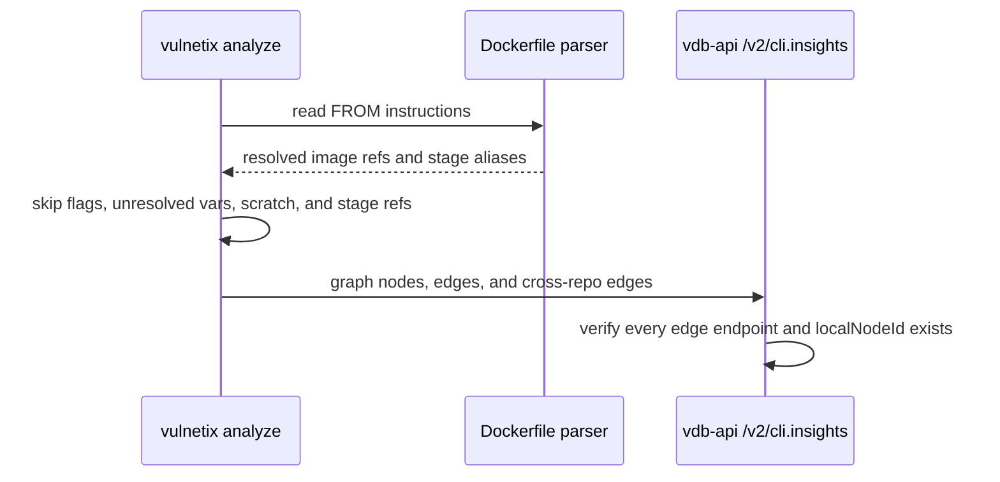

# CLI insights graph

Last Updated: 2026-07-23

`vulnetix analyze` sends its dependency graph to vdb-api through `POST /v2/cli.insights`.
The API persists the graph and rejects malformed edges, so the CLI must only emit nodes
that are real local findings from the repository.

## Dockerfile image collection

Dockerfile `FROM` lines are parsed as Dockerfile syntax, not as a single regex capture.
The collector has to handle:

- `FROM --platform=$BUILDPLATFORM golang:1.24-alpine AS builder`
- `FROM ${BASE_IMAGE} AS runtime`
- multi-line instructions with backslash continuations
- stage references such as `FROM builder`

The image token is the first non-option token after `FROM`. `ARG` defaults declared
earlier in the Dockerfile may be expanded into the image token, but unresolved variables
are not reported as external images. Stage aliases are also skipped because they point to
another local build stage, not to a registry dependency.

The CLI must never emit a container-image node for a Dockerfile option. In particular,
`container_image:--platform=$buildplatform` is invalid because `--platform=$BUILDPLATFORM`
is a flag on the `FROM` instruction, not an image reference.

## Graph invariants

Every emitted edge must point to node IDs present in the same graph payload. Cross-repo
edges use `localNodeId` to identify the local node and `joinKey` as the registry-level
lookup key. For container images, `localNodeId` must refer to a `container_image` node
whose name matches the `joinKey`.

## Related documents

- [vdb-api/.repo/cli-insights-graph.md](https://github.com/vulnetix/vdb-api/blob/main/.repo/cli-insights-graph.md), the ingestion-side validation contract.
