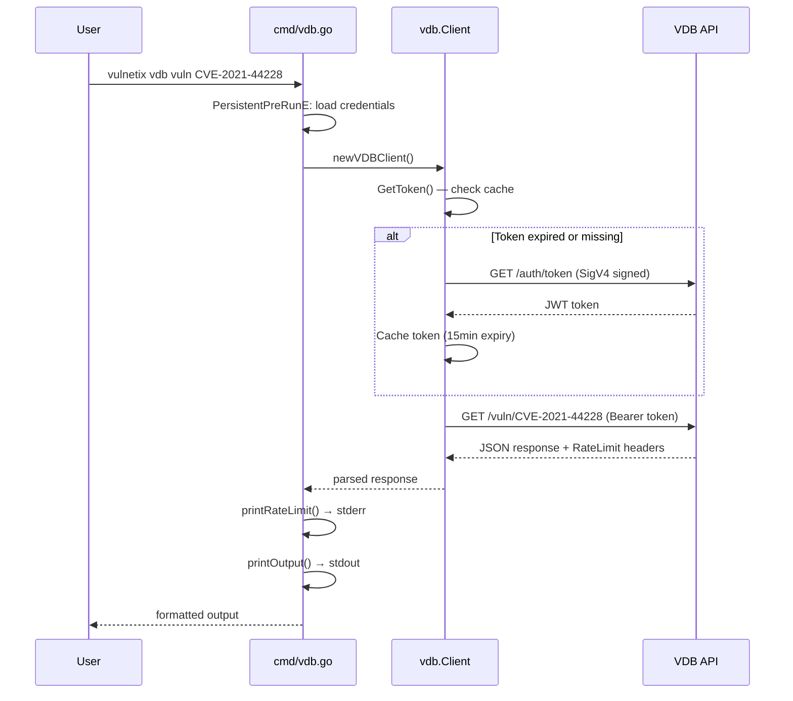
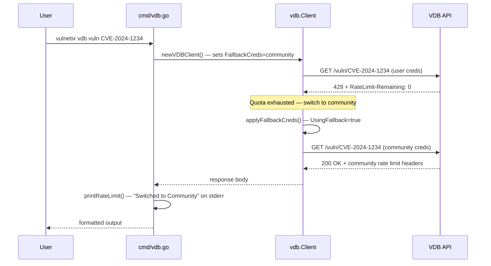
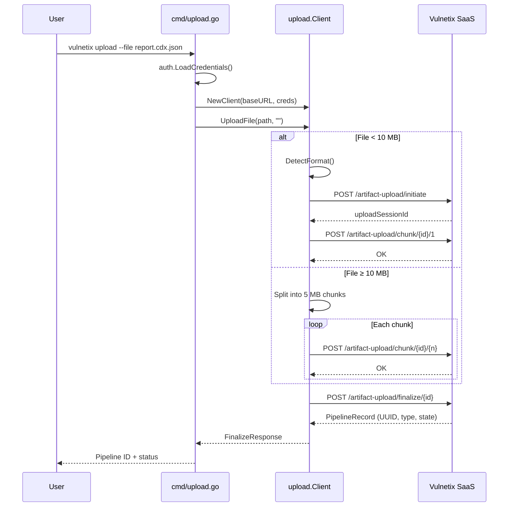
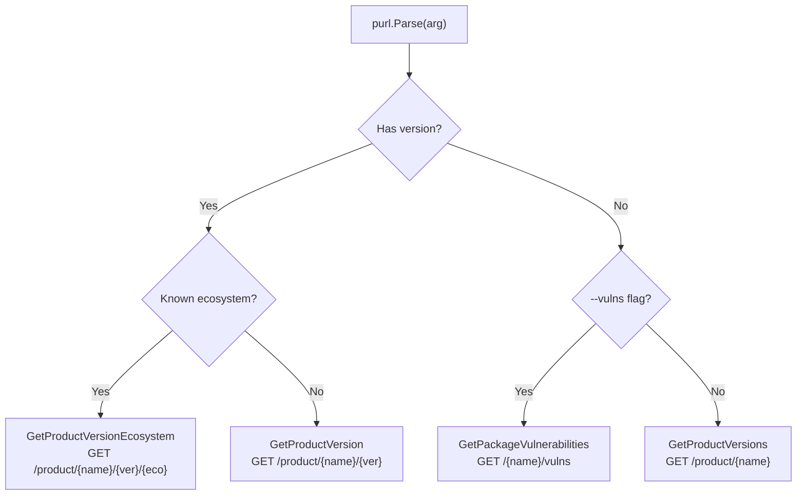

# Vulnetix CLI — System Documentation

## Business Rules

1. **Remediation over discovery** — The CLI prioritizes resolving vulnerabilities, not just finding them. Upload artifacts, query the VDB for fix data, and track pipeline status.

2. **Authentication precedence** — Credentials resolve in strict order:
   1. `VULNETIX_API_KEY` + `VULNETIX_ORG_ID` env vars → Direct API Key
   2. `VVD_ORG` + `VVD_SECRET` env vars → SigV4
   3. `.vulnetix/credentials.json` (project directory)
   4. `~/.vulnetix/credentials.json` (home directory)
   5. Community fallback (built-in, automatic — `--no-community` to disable)

   First match wins. No merging across sources.

   The community fallback fires in two scenarios:
   - **Startup** — no credentials found after checking all four sources above
   - **Runtime** — authenticated credentials received HTTP 429 with `RateLimit-Remaining: 0`

   In both cases the fallback uses the same DirectAPIKey pipeline as regular users, subject to community-tier rate limits. It is suppressed when `--no-community` is set and never fires when already on community credentials (prevents a loop).

3. **Org ID is always a UUID** — Every operation that requires an org ID validates it with `uuid.Parse()`. No other format is accepted.

4. **CI/CD platform auto-detection** — `config.DetectPlatform()` checks environment variables in a fixed order: GitHub Actions → GitLab CI → Azure DevOps → Bitbucket → Jenkins → Kubernetes → Podman → Docker → CLI (fallback).

5. **Upload format auto-detection** — `upload.DetectFormat()` inspects file name patterns first (`.cdx.`, `.spdx.`, `.sarif`, `.vex.`, `.csaf.`), then JSON content signatures (`bomFormat`, `spdxVersion`, `$schema`). Falls back to `"auto"` for the server to decide.

6. **Chunked upload threshold** — Files ≥ 10 MB use chunked upload (5 MB per chunk). Below that, a single-request upload is used.

7. **VDB rate limits** — Every VDB API response is inspected for `RateLimit-*` headers. Rate limit info is displayed on stderr after each command.

8. **Retry policy** — VDB client retries up to 2 times with exponential backoff (2s, 4s) on HTTP 429/502/503/504 and transient network errors (timeout, connection refused/reset). Exception: when a 429 carries `RateLimit-Remaining: 0` (quota fully exhausted), the client skips backoff, switches to community credentials, and retries immediately before falling back to normal retry logic.

9. **Output modes** — VDB commands support `--output pretty` (default, human-friendly JSON to stdout) and `--output json` (machine JSON to stdout, status messages to stderr).

10. **PURL dispatch** — The `vdb purl` command maps PURL strings to VDB endpoints:
    - Has version + known ecosystem → `GET /product/{name}/{version}/{ecosystem}`
    - Has version + unknown ecosystem → `GET /product/{name}/{version}`
    - No version + `--vulns` → `GET /{name}/vulns`
    - No version (default) → `GET /product/{name}`

11. **VDB memory management** — All VDB subcommands automatically record queries and environment context to `.vulnetix/memory.yaml` unless `--disable-memory` is set. Memory writes are non-fatal (warnings on stderr). The `vdb vuln` command additionally extracts severity, aliases, and safeHarbour from the API response and upserts a `FindingRecord`.

12. **Environment context priority** — When gathering environment context for memory, values are merged in this order (last wins):
    1. Auto-gathered from git repo and env vars (unless `--ignore-env`)
    2. `--context` JSON string overrides
    3. Explicit flags (`--git-branch`, `--github-org`, etc.) — highest priority

13. **Binary self-containment** — The CLI binary embeds all static reference data and requires no external files at runtime:
    - **Embedded** (static, changes rarely): SPDX license database (`spdx_licenses.json` via `//go:embed`), well-known package→license mappings, Docker official image licenses, `ClassifyLicenseText` patterns, `NormalizeSPDX` rules.
    - **Network-fetched** (fresh data on demand): ecosystem registry APIs (deps.dev, RubyGems, Hex.pm, Hackage, CRAN, Packagist, pub.dev, CocoaPods, JuliaRegistries, GitHub), VDB API, Terraform Registry, Docker Hub API.
    - **Filesystem reads** (user's own project files): manifest files, Go module cache, user allow-list YAML.
    - Nothing is read from a path relative to the binary; all lookups either use embedded data or network APIs.

---

## Environment Command

`vulnetix env` displays structured metadata about the current environment. Use `--output json` for machine-readable output consumed by the Claude Code Plugin.

Output includes:
- CLI version, commit, build date
- Platform detection (github, gitlab, cli, etc.)
- System info (hostname, shell, OS, arch)
- Git context (branch, commit, remotes, dirty state, worktree)
- Detected package managers (shallow scan of cwd for manifest files)
- Memory file status (path and existence)

---

## Triage Command

The `vulnetix triage` command provides two operational modes:

### 1. GitHub Alerts Triage (default)

Fetches vulnerability alerts from GitHub security tools (Dependabot, CodeQL, Secret Scanning)
and enriches them with VDB data for human review.

```
vulnetix triage --provider dependabot
vulnetix triage --provider codeql
vulnetix triage --provider github
```

**Flags:**
- `--provider` - Alert source: `github`, `dependabot`, `codeql`, `secrets`
- `--repo` - Repository in `owner/repo` format (auto-detected from git/GITHUB_REPOSITORY)
- `--all` - Include dismissed alerts (open only by default)
- `--concurrency` - Number of concurrent VDB lookups (default 5)
- `--format` - Output: `tui` (interactive, default), `json`, `text`
- `--include-guidance` - Include CWE remediation guidance (default true)

The command outputs an interactive TUI (unless `--format json` or `--format text`) that allows
users to view alerts, apply resolutions (dismissals) to GitHub, and record VEX decisions to
`.vulnetix/memory.yaml`.

### 2. Vulnetix VEX Generation

Triage specific vulnerability IDs using the Vulnetix VDB and generate VEX attestations.
This mode aligns with the Claude Code plugin's bulk triage agent, sharing the same
memory file schema and VEX generation logic.

```
vulnetix triage --provider vulnetix CVE-2021-44228 CVE-2022-22965
echo "CVE-2021-44228" | vulnetix triage --provider vulnetix
```

**Flags:**
- `--provider vulnetix` - Select the vulnetix provider (short: `-p vulnetix`)
- `--vex-format` - Output format: `openvex` (default), `cdx` (CycloneDX 1.5), `json`
- `--vex-output` - Write VEX to file (default: stdout)
- `--memory-dir` - Path to `.vulnetix` directory (default `.vulnetix`)
- `--disable-memory` - Disable memory updates (for read-only triage)
- `--pkg`, `--version`, `--ecosystem` - Provide package context when not available in memory

**Behavior:**
- Reads existing memory to obtain package/version/ecosystem context for each vuln ID.
- If missing, the explicit flags provide fallback context.
- Triages each CVE via the VDB (vuln, exploits, affected, remediation, scorecard).
- Generates VEX statements reflecting the triage outcome (status, justification, action).
- Updates `.vulnetix/memory.yaml` with findings, CWSS scores, threat models, and history.
- Writes a single consolidated VEX document to stdout or `--vex-output`.

**VEX Status Mapping:**
- `not_affected` - Not affected by this vulnerability (justification required)
- `affected` - Vulnerable code is present and exploitable
- `fixed` - Remediation has been applied
- `under_investigation` - Still being analyzed (default)

The VEX output can be used for compliance, supply chain security, and as input to
vulnerability management systems.

---

## License Command

`vulnetix license` scans a directory tree for package manifests, resolves each dependency's license, detects conflicts, and evaluates against an optional allow list. Everything runs locally — no packages or results are uploaded.

### Flags

| Flag | Default | Purpose |
|------|---------|---------|
| `--path` | `.` | Directory to scan |
| `--depth` | `3` | Max manifest discovery depth |
| `--exclude` | — | Glob patterns to skip (repeatable) |
| `--mode` | `inclusive` | `inclusive` (cross-manifest conflicts) or `individual` (per-manifest) |
| `--allow` | — | Comma-separated SPDX IDs that are allowed |
| `--allow-file` | — | YAML file of allowed SPDX IDs |
| `--severity` | — | Exit 1 if any finding meets or exceeds this level (`low`, `medium`, `high`, `critical`) |
| `-o` / `--output` | pretty table | `json` (CycloneDX), `json-spdx` (SPDX 2.3) |
| `--dry-run` | false | Detect files + parse packages; skip license evaluation |
| `--from-memory` | false | Reconstruct prior results from `.vulnetix/memory.yaml` without re-scanning |
| `--results-only` | false | Suppress full package table; show summary and findings only |

### License Resolution Waterfall (8 tiers, in order)

1. **Manifest field extraction** — reads `license` field from `package.json`, `composer.json`, `Cargo.toml`, `pyproject.toml`.
2. **Go module cache** — reads LICENSE file from local `$GOMODCACHE` for golang packages.
3. **Container/IaC** — Docker OCI labels (via podman/docker inspect), Docker Hub API, Terraform Registry API → GitHub, Nix CLI.
4. **Embedded well-known DB** — ~60 hardcoded `ecosystem:name → SPDX-ID` entries for common packages that don't declare licenses (Go stdlib extensions, popular npm/pypi/cargo packages, renamed CocoaPods, Ruby stdlib).
5. **Ecosystem registry APIs** — native per-ecosystem APIs (concurrent, 5 goroutines, in-memory deduplication cache):
   - `rubygems` / `gem` → `rubygems.org/api/v1/gems/{name}.json`
   - `hex` / `erlang` → `hex.pm/api/packages/{name}`
   - `pub` → `pub.dev/api/packages/{name}` → repository URL → GitHub (handles monorepo `tree/branch/subdir` paths and `packages/{name}/LICENSE` fallback)
   - `cabal` / `stack` / `hackage` → `hackage.haskell.org/package/{name}/{name}.cabal`
   - `cran` → `cran.r-project.org/web/packages/{name}/DESCRIPTION`
   - `composer` → `packagist.org/packages/{name}.json`
   - `cocoapods` → `trunk.cocoapods.org/api/v1/pods/{name}` for latest version, then `raw.githubusercontent.com/CocoaPods/Specs/master/Specs/{md5[0]}/{md5[1]}/{md5[2]}/{name}/{version}/{name}.podspec.json`; falls back to GitHub API directory listing for deprecated/renamed pods
   - `julia` → `JuliaRegistries/General/{letter}/{name}/Package.toml` → parses `repo` + `subdir`; checks `{subdir}/LICENSE.md` for monorepos
   - `crystal` → `github:` field captured during `shard.yml`/`shard.lock` parsing → GitHub license
   - `opam` → `ocaml/opam-repository` on GitHub
6. **deps.dev API** — `api.deps.dev/v3` for golang, npm, pypi, cargo, maven, nuget.
7. **GitHub API** — 4 strategies: `gh` CLI repo API → dedicated license endpoint → known license file names → directory discovery; PAT fallback if `gh` CLI unavailable.
8. **Provenance computation** — fills `IntroducedPaths` and `PathCount` from dependency graphs.

Unresolved packages are marked `UNKNOWN`.

### Output

Findings are appended to `.vulnetix/sbom.cdx.json` (CycloneDX format) alongside vulnerability findings from `scan`. Neither command overwrites the other's section of the SBOM.

---

## Scan Command

`vulnetix scan` performs a comprehensive vulnerability scan of the local project. It discovers manifests, extracts packages, looks up vulnerabilities in the VDB, enriches results with EPSS/CVSS/SSVC scores, and applies configurable quality gates.

### Key Flags

| Flag | Purpose |
|------|---------|
| `--path` | Directory to scan (default `.`) |
| `--depth` | Manifest discovery depth (default `3`) |
| `--severity` | Exit 1 if any vuln meets or exceeds severity |
| `--malware` | Exit 1 if any malicious package detected |
| `--exploits` | Exit 1 if any exploited vuln found |
| `--eol` | Exit 1 if any end-of-life packages found |
| `-o` / `--output` | Output format: `pretty`, `json`, `json-spdx` |
| `--upload` | Upload SBOM to Vulnetix SaaS after scan |
| `--from-memory` | Reconstruct prior scan results without re-scanning |

Results are saved to `.vulnetix/sbom.cdx.json`.

---

## VDB Memory Management

### Context Flags (inherited by all `vdb` subcommands)

| Flag | Purpose |
|------|---------|
| `--package-manager` | Package manager (npm, pip, cargo) |
| `--manifest-format` | Manifest file (package.json, requirements.txt) |
| `--git-local-dir` | Local git repository path |
| `--git-branch` | Current git branch name |
| `--github-org` | GitHub organization |
| `--github-repo` | GitHub repository |
| `--github-pr` | GitHub pull request number |
| `--remote-url` | Git remote URL |
| `--remote-branch` | Git remote tracking branch |
| `--committer-name` | Git committer name |
| `--committer-email` | Git committer email |
| `--ignore-env` | Disable auto env gathering, keep memory |
| `--context` | JSON string of context overrides |
| `--disable-memory` | Disable all memory operations (root flag) |

### Memory File Schema (additive fields)

```yaml
environment:              # last-gathered env context
  platform: cli
  git_branch: main
  git_commit: abc123
  remote_url: https://...
  committer_name: ...
  committer_email: ...
  github_org: ...
  github_repo: ...
  package_manager: npm
  manifest_format: package.json
vdb_queries:              # recent query log (max 50)
  - timestamp: 2025-01-01T00:00:00Z
    command: vuln
    args: CVE-2021-44228
    api_version: v1
findings:                 # enriched by vdb vuln lookups
  CVE-2021-44228:
    severity: CRITICAL
    aliases: [...]
    safe_harbour: 0.95
    source: vulnetix
    history:
      - date: ...
        event: vdb-lookup
```

### Flow

1. `PersistentPreRunE` on `vdbCmd`: gather env context → load memory
2. Each subcommand's `RunE`: call `recordVDBQuery()` (+ `RecordVulnLookup` for `vuln`)
3. `PersistentPostRunE` on `vdbCmd`: update environment → save memory

---

## Architecture

### High-Level Component Diagram

```mermaid
graph TB
    User([User / CI Runner])

    subgraph CLI["vulnetix binary"]
        Main["main.go<br/>os.Exit wrapper"]
        Cobra["cmd/ package<br/>Cobra commands"]

        subgraph Commands["Command Files"]
            Root["root.go<br/>info healthcheck"]
            Auth["auth.go<br/>login/status/verify/logout"]
            Upload["upload.go<br/>file upload"]
            GHA["gha.go<br/>GitHub Actions upload + status"]
            VDB["vdb.go + vdb_v2.go<br/>VDB subcommands"]
            Scan["scan.go<br/>vulnerability scan + quality gates"]
            License["license.go<br/>license analysis (8-tier)"]
            Env["env.go<br/>environment context"]
            Version["version.go + update.go<br/>self-update"]
        end
    end

    subgraph Pkg["pkg/ packages (public API)"]
        AuthPkg["auth/<br/>Credentials, AuthMethod,<br/>Save/Load/Remove"]
        CachePkg["cache/<br/>Disk TTL cache"]
        VDBPkg["vdb/<br/>Client, SigV4 signing,<br/>token cache, retry, all API methods"]
    end

    subgraph Internal["internal/ packages"]
        ConfigPkg["config/<br/>VulnetixConfig, CIContext,<br/>platform detection"]
        MemoryPkg["memory/<br/>Memory, FindingRecord,<br/>EnvironmentContext, VDBQuery"]
        UploadPkg["upload/<br/>Client, simple + chunked,<br/>format detection"]
        GHPkg["github/<br/>ArtifactCollector,<br/>ArtifactUploader"]
        PURLPkg["purl/<br/>Parse, PackageName,<br/>EcosystemForType"]
        UpdatePkg["update/<br/>semver, checker, updater"]
        ScanPkg["scan/<br/>manifest parsers, VDB enrichment,<br/>quality gates, depgraph"]
        LicensePkg["license/<br/>8-tier resolution waterfall,<br/>SPDX DB (embedded), evaluate,<br/>registry APIs, GitHub API"]
        CDXPkg["cdx/<br/>CycloneDX BOM read/write/merge"]
    end

    subgraph External["External Services"]
        VDBApi["VDB API<br/>api.vdb.vulnetix.com/v1"]
        AppApi["Vulnetix SaaS<br/>app.vulnetix.com/api"]
        GHAPI["GitHub API<br/>api.github.com"]
        Registries["Ecosystem Registries<br/>rubygems.org, hex.pm, hackage,<br/>cran, packagist, pub.dev,<br/>cocoapods, juliahub, deps.dev"]
        GHReleases["GitHub Releases<br/>Vulnetix/cli"]
    end

    User --> Main --> Cobra
    Cobra --> Commands

    Root --> AuthPkg & ConfigPkg
    Auth --> AuthPkg & UploadPkg & VDBPkg
    Upload --> AuthPkg & UploadPkg
    GHA --> AuthPkg & UploadPkg & GHPkg
    VDB --> AuthPkg & VDBPkg & PURLPkg & MemoryPkg
    Scan --> AuthPkg & VDBPkg & ScanPkg & CDXPkg & MemoryPkg
    License --> ScanPkg & LicensePkg & CDXPkg & MemoryPkg
    Env --> ConfigPkg & MemoryPkg
    Version --> UpdatePkg

    VDBPkg --> VDBApi
    UploadPkg --> AppApi
    GHPkg --> GHAPI
    LicensePkg --> GHAPI & Registries
    UpdatePkg --> GHReleases
```



### Package Dependency Graph

```mermaid
graph LR
    cmd --> auth
    cmd --> config
    cmd --> vdb
    cmd --> upload
    cmd --> github
    cmd --> purl
    cmd --> update
    cmd --> scan
    cmd --> license
    cmd --> cdx

    scan --> vdb
    license --> scan
    github --> upload

    style cmd fill:#2d5a27
    style auth fill:#5a2727
    style vdb fill:#27455a
    style upload fill:#27455a
    style purl fill:#4a4a27
    style scan fill:#2d5a27
    style license fill:#5a4527
```



No circular dependencies. `pkg/auth` and `pkg/vdb` are the leaf packages used by commands and other internal packages.

---

## Data Flow

### VDB Query (authenticated)



### Quota-Exhausted Community Fallback



### Upload Flow



### PURL Dispatch Decision Tree



---

## VDB API — OpenAPI Source & Tests

### Base URL

```
https://api.vdb.vulnetix.com/v1
```

### Authentication

Two methods, resolved by `vdb.Client.DoRequest()`:

| Method | Header format | How obtained |
|--------|-------------|-------------|
| SigV4 | `Bearer {jwt}` | `GET /auth/token` with AWS SigV4-SHA512 signature |
| Direct API Key | `ApiKey {orgId}:{hexDigest}` | Pre-computed, stored in credentials |

### Endpoints used by CLI

| CLI command | Method | Path | Pagination | Source |
|-------------|--------|------|-----------|--------|
| `vdb vuln` | GET | `/vuln/{id}` | — | `api.go:67` |
| `vdb exploits` | GET | `/exploits/{id}` | — | `api.go:196` |
| `vdb fixes` | GET | `/vuln/{id}/fixes` | — | `api.go:213` |
| `vdb ecosystems` | GET | `/ecosystems` | — | `api.go:84` |
| `vdb product` (list) | GET | `/product/{name}` | `?limit=&offset=` | `api.go:119` |
| `vdb product` (version) | GET | `/product/{name}/{ver}` | — | `api.go:139` |
| `vdb product` (version+eco) | GET | `/product/{name}/{ver}/{eco}` | — | `api.go:342` |
| `vdb vulns` | GET | `/{name}/vulns` | `?limit=&offset=` | `api.go:156` |
| `vdb versions` | GET | `/{name}/versions` | — | `api.go:230` |
| `vdb gcve` | GET | `/gcve?start=&end=` | — | `api.go:247` |
| `vdb spec` | GET | `/spec` | — | `api.go:179` |
| `vdb sources` | GET | `/sources` | — | `api.go:267` |
| `vdb metric-types` | GET | `/metric-types` | — | `api.go:282` |
| `vdb exploit-sources` | GET | `/exploit-sources` | — | `api.go:297` |
| `vdb exploit-types` | GET | `/exploit-types` | — | `api.go:312` |
| `vdb fix-distributions` | GET | `/fix-distributions` | — | `api.go:327` |
| `vdb purl` | — | Dispatches to one of the above | varies | `vdb.go:749` |

### Upload API (app.vulnetix.com)

| Operation | Method | Path |
|-----------|--------|------|
| Initiate | POST | `/artifact-upload/initiate` |
| Chunk | POST | `/artifact-upload/chunk/{sessionId}/{chunkNumber}` |
| Finalize | POST | `/artifact-upload/finalize/{sessionId}` |
| Verify auth | GET | `/cli/verify` |

### Rate Limit Headers

```
RateLimit-MinuteLimit: 1000
RateLimit-Remaining: 999
RateLimit-Reset: 45
RateLimit-WeekLimit: 50000
RateLimit-WeekRemaining: 49999
RateLimit-WeekReset: 604800
```

### Testing strategy

- **Unit tests** (`*_test.go`) — No live API calls. Table-driven tests with `testify/assert`.
- **Test helpers** — `cmd/root_test.go:executeCommand()` captures stdout+stderr and mocks `os.Exit`. `internal/testutils/env.go` provides `SetEnv()` for safe env var manipulation.
- **VDB commands** — Tests validate arg parsing, PURL parsing, and error surfacing without credentials (API calls fail gracefully).
- **Upload/GitHub** — `httptest.NewServer` mocks in `internal/github/*_test.go` for artifact download/upload flows.
- **No integration tests** — All API interactions are unit-tested with mocks or validated at the arg-parsing level.

---

## Adding a New VDB Subcommand — Checklist

Use this to avoid duplicating patterns already handled by existing commands. Follow the `purlCmd` and `productCmd` as reference implementations.

### 1. Can an existing command serve the need?

Before creating a new subcommand, check if the use case is already covered:

| If you need to... | Use existing... |
|-------------------|----------------|
| Query by PURL string | `vdb purl` (parses and dispatches automatically) |
| Get product versions | `vdb product <name>` |
| Get specific version info | `vdb product <name> <version>` |
| Get version + ecosystem | `vdb product <name> <version> <ecosystem>` |
| Get package vulnerabilities | `vdb vulns <name>` |
| Get vulnerability details | `vdb vuln <id>` |

If your feature is a **convenience wrapper** (like `purl` wraps `product` + `vulns`), implement it as dispatch logic that calls existing `client.*` methods — do not duplicate API call code.

### 2. Add the API method (if new endpoint)

File: `internal/vdb/api.go`

```go
func (c *Client) GetNewThing(param string) (map[string]interface{}, error) {
    path := fmt.Sprintf("/new-thing/%s", url.PathEscape(param))
    respBody, err := c.DoRequest("GET", path, nil)
    if err != nil {
        return nil, err
    }
    var result map[string]interface{}
    if err := json.Unmarshal(respBody, &result); err != nil {
        return nil, fmt.Errorf("failed to parse response: %w", err)
    }
    return result, nil
}
```

**Rules:**
- Always use `url.PathEscape()` for path parameters
- Use `buildPaginationQuery()` for paginated endpoints
- Use typed response structs only when the command needs to inspect fields (e.g., `ProductVersionsResponse`). Otherwise `map[string]interface{}` is fine.
- `DoRequest` handles auth, retries, and rate limit header capture — never call `HTTPClient.Do` directly for data endpoints.

### 3. Add the Cobra command

File: `cmd/vdb.go`

Place the `var newCmd = &cobra.Command{...}` block **before** the `init()` function, following the existing ordering.

**Required pattern:**

```go
var newThingCmd = &cobra.Command{
    Use:   "new-thing <arg>",
    Short: "One line description",
    Long:  `Detailed description with examples`,
    Args:  cobra.ExactArgs(1),  // or MinimumNArgs, NoArgs
    RunE: func(cmd *cobra.Command, args []string) error {
        client := newVDBClient()           // reuse — do NOT create your own

        // Status message: stderr if JSON mode, stdout otherwise
        if vdbOutput == "json" {
            fmt.Fprintf(os.Stderr, "Fetching...\n")
        } else {
            fmt.Printf("Fetching...\n")
        }

        result, err := client.GetNewThing(args[0])
        if err != nil {
            return fmt.Errorf("failed to get new thing: %w", err)
        }
        printRateLimit(client)             // reuse — always call after API call
        recordVDBQuery("new-thing", args[0]) // reuse — always call for memory tracking
        return printOutput(result, vdbOutput) // reuse — handles json vs pretty
    },
}
```

### 4. Register in `init()`

```go
func init() {
    // ...existing registrations...
    vdbCmd.AddCommand(newThingCmd)

    // Add flags if needed
    newThingCmd.Flags().Int("limit", 100, "...")
    newThingCmd.Flags().Int("offset", 0, "...")
}
```

### 5. Reuse checklist (do NOT duplicate)

| Need | Reuse | Location |
|------|-------|----------|
| VDB client creation | `newVDBClient()` | `vdb.go:569` |
| JSON/pretty output | `printOutput(data, vdbOutput)` | `vdb.go:585` |
| Rate limit display | `printRateLimit(client)` | `vdb.go:496` |
| Memory query log | `recordVDBQuery(cmd, args)` | `vdb.go` |
| Pagination query string | `buildPaginationQuery(limit, offset)` | `api.go:102` |
| PURL parsing | `purl.Parse()` + `purl.PackageName()` | `internal/purl/purl.go` |
| Ecosystem mapping | `purl.EcosystemForType()` | `internal/purl/purl.go` |
| Credential loading | `PersistentPreRunE` on `vdbCmd` | `vdb.go:55` (inherited) |

**Never:**
- Create a new `vdb.Client` manually in command code — use `newVDBClient()`
- Print JSON to stdout yourself — use `printOutput()`
- Read `vdbOrgID`/`vdbSecretKey` directly — `PersistentPreRunE` handles this
- Skip `printRateLimit()` — all VDB commands should show rate info
- Skip `recordVDBQuery()` — all VDB commands should log to memory

### 6. Add tests

File: `cmd/vdb_<name>_test.go`

```go
func TestNewThingCommand(t *testing.T) {
    tests := []struct {
        name        string
        args        []string
        expectError bool
        errContains string
    }{
        {"no args", []string{"vdb", "new-thing"}, true, "accepts 1 arg(s)"},
        {"too many args", []string{"vdb", "new-thing", "a", "b"}, true, "accepts 1 arg(s)"},
    }
    for _, tt := range tests {
        t.Run(tt.name, func(t *testing.T) {
            _, err := executeCommand(t, rootCmd, tt.args...)
            if tt.expectError {
                assert.Error(t, err)
                assert.Contains(t, err.Error(), tt.errContains)
            } else {
                assert.NoError(t, err)
            }
        })
    }
}
```

- Use `executeCommand()` from `cmd/root_test.go` — it captures output and mocks `os.Exit`
- Test arg validation and error messages — these run without credentials
- Do NOT test API responses without a mock server

### 7. Verify

```bash
make fmt && make lint && make test
make dev && ./bin/vulnetix vdb new-thing --help
```

---

## File Map

```
.
├── main.go                          Entry point (delegates to cmd.Execute)
├── cmd/
│   ├── root.go                      Root command + info healthcheck
│   ├── root_test.go                 executeCommand() helper + root tests
│   ├── auth.go                      auth login/status/verify/logout
│   ├── completion.go                Shell completion subcommand
│   ├── env.go                       Environment context display command
│   ├── from_memory.go               Shared --from-memory reconstruction helpers
│   ├── gha.go                       GitHub Actions artifact upload + status
│   ├── gh_dependabot.go             GitHub Dependabot alert fetching helpers
│   ├── license.go                   License analysis command (8-tier waterfall)
│   ├── scan.go                      Vulnerability scan command + quality gates
│   ├── upload.go                    Single-file upload command
│   ├── update.go                    Self-update command
│   ├── vdb.go                       VDB parent + V1 subcommands + helpers + memory wiring
│   ├── vdb_ecosystem.go             Ecosystem listing subcommand
│   ├── vdb_purl_test.go             PURL subcommand tests
│   ├── vdb_v2.go                    V2-only VDB subcommands
│   └── version.go                   Version display + update check
├── internal/
│   ├── analytics/                   Anonymous usage analytics (opt-out)
│   ├── cdx/                         CycloneDX BOM read/write/merge helpers
│   │   └── schema/                  CycloneDX 1.7 JSON schema types
│   ├── config/
│   │   └── config.go                VulnetixConfig, CIContext, platform detection
│   ├── display/                     Terminal table and formatting utilities
│   ├── filetree/                    Directory tree walker for manifest discovery
│   ├── gitctx/                      Git context extraction (branch, commit, remote)
│   ├── github/
│   │   ├── artifact.go              ArtifactCollector (download from GH API)
│   │   └── uploader.go              ArtifactUploader (legacy transaction flow)
│   ├── license/
│   │   ├── types.go                 PackageLicense, LicenseRecord, Finding, AnalysisResult
│   │   ├── detect.go                DetectLicenses orchestration + manifest extractors + well-known DB
│   │   ├── evaluate.go              Policy evaluation, conflict detection, FindingRecord generation
│   │   ├── spdx.go                  Embedded SPDX DB (//go:embed spdx_licenses.json)
│   │   ├── spdx_licenses.json       ~700-entry SPDX license database (embedded at build time)
│   │   ├── spdx_output.go           SPDX 2.3 JSON output formatter
│   │   ├── filesystem.go            Go module cache scanner + ClassifyLicenseText
│   │   ├── container.go             Docker/Terraform/Nix license resolution
│   │   ├── depsdev.go               deps.dev API batch resolver (golang/npm/pypi/cargo/maven/nuget)
│   │   ├── registries.go            Ecosystem registry API fetchers (RubyGems, Hex.pm, Hackage,
│   │   │                            CRAN, Packagist, pub.dev, CocoaPods, Julia, Crystal, OCaml)
│   │   ├── github.go                GitHub license resolution (4 strategies + PAT fallback)
│   │   ├── allowlist.go             AllowList load from YAML or CSV
│   │   ├── category.go              License category rules (permissive/copyleft/proprietary)
│   │   └── cdx.go                   CycloneDX SBOM license section read/write
│   ├── memory/                      Memory file schema (memory.yaml) + VDB query log
│   ├── purl/
│   │   ├── purl.go                  PURL parser, PackageName, EcosystemForType
│   │   └── purl_test.go             Parser + ecosystem mapping tests
│   ├── scan/
│   │   ├── local.go                 ScopedPackage type, manifest group types
│   │   ├── local_extra.go           Per-ecosystem manifest parsers (30+ file types)
│   │   ├── detector.go              ManifestDetector, FileType classification
│   │   ├── walker.go                WalkForScanFiles, WalkOptions
│   │   ├── depgraph.go              DependencyGraph, FindPath, IsDirect
│   │   ├── enrich.go                VDB enrichment, EPSS/CVSS/SSVC scoring
│   │   ├── gates.go                 Quality gate evaluation (severity/malware/exploits/eol)
│   │   ├── payload.go               SBOM construction helpers
│   │   ├── poller.go                Upload status polling
│   │   ├── results.go               Scan result display formatting
│   │   ├── upload.go                SBOM upload to Vulnetix SaaS
│   │   ├── vdb_lookup.go            VDB batch lookup coordinator
│   │   └── version_check.go         EOL version check helpers
│   ├── testutils/
│   │   ├── env.go                   SetEnv() test helper
│   │   └── helpers.go               Other test utilities
│   ├── triage/                      VEX generation + CWSS scoring + triage logic
│   ├── tui/                         Interactive terminal UI (bubbletea) for triage display
│   └── update/
│       ├── semver.go                Version parsing + comparison
│       ├── checker.go               GitHub release latest check
│       └── updater.go               Binary self-replacement
├── pkg/                             Public API packages (stable interface)
│   ├── auth/                        AuthMethod, Credentials, Save/Load/Remove, community fallback
│   ├── cache/                       Disk-backed TTL cache for VDB responses
│   ├── tty/                         TTY detection (isatty wrapper)
│   └── vdb/                         VDB Client, SigV4 signing, token cache, retry, all API methods
├── flake.nix                        Nix development environment + CI reproducibility
├── justfile                         Build, test, lint, format targets (use `just`)
├── CLAUDE.md                        → AGENTS.md (Claude Code instructions)
├── AGENTS.md                        Development guide for AI agents
└── _system.md                       This file
```
