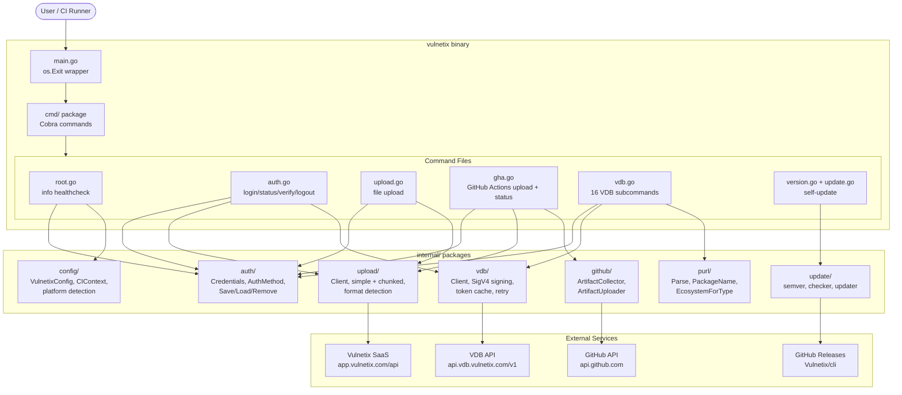
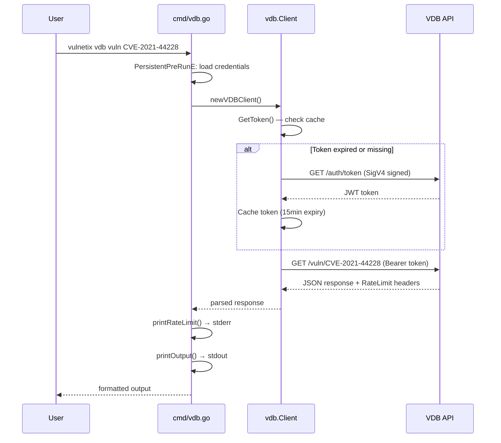
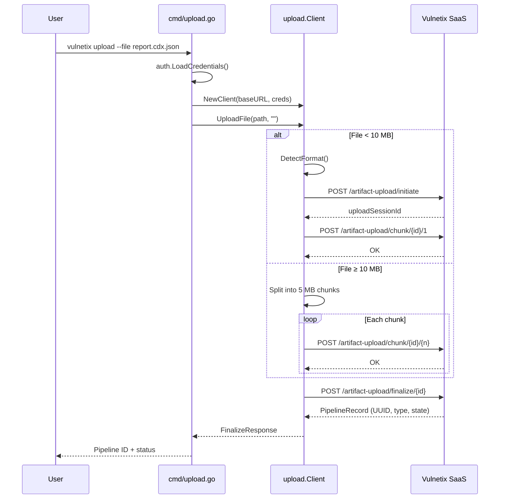
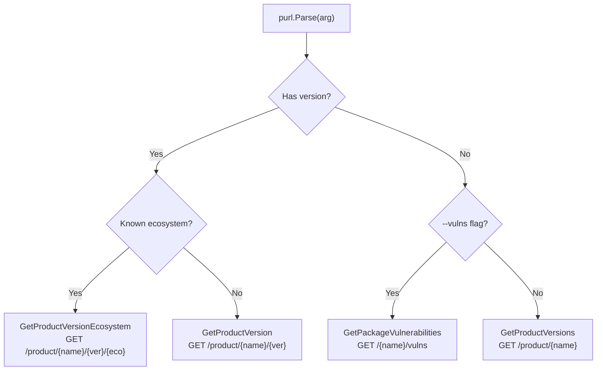

# Vulnetix CLI — System Documentation

## Business Rules

1. **Remediation over discovery** — The CLI prioritizes resolving vulnerabilities, not just finding them. Upload artifacts, query the VDB for fix data, and track pipeline status.

2. **Authentication precedence** — Credentials resolve in strict order:
   1. `VULNETIX_API_KEY` + `VULNETIX_ORG_ID` env vars → Direct API Key
   2. `VVD_ORG` + `VVD_SECRET` env vars → SigV4
   3. `.vulnetix/credentials.json` (project directory)
   4. `~/.vulnetix/credentials.json` (home directory)

   First match wins. No merging across sources.

3. **Org ID is always a UUID** — Every operation that requires an org ID validates it with `uuid.Parse()`. No other format is accepted.

4. **CI/CD platform auto-detection** — `config.DetectPlatform()` checks environment variables in a fixed order: GitHub Actions → GitLab CI → Azure DevOps → Bitbucket → Jenkins → Kubernetes → Podman → Docker → CLI (fallback).

5. **Upload format auto-detection** — `upload.DetectFormat()` inspects file name patterns first (`.cdx.`, `.spdx.`, `.sarif`, `.vex.`, `.csaf.`), then JSON content signatures (`bomFormat`, `spdxVersion`, `$schema`). Falls back to `"auto"` for the server to decide.

6. **Chunked upload threshold** — Files ≥ 10 MB use chunked upload (5 MB per chunk). Below that, a single-request upload is used.

7. **VDB rate limits** — Every VDB API response is inspected for `RateLimit-*` headers. Rate limit info is displayed on stderr after each command.

8. **Retry policy** — VDB client retries up to 2 times with exponential backoff (2s, 4s) on HTTP 502/503/504 and transient network errors (timeout, connection refused/reset).

9. **Output modes** — VDB commands support `--output pretty` (default, human-friendly JSON to stdout) and `--output json` (machine JSON to stdout, status messages to stderr).

10. **PURL dispatch** — The `vdb purl` command maps PURL strings to VDB endpoints:
    - Has version + known ecosystem → `GET /product/{name}/{version}/{ecosystem}`
    - Has version + unknown ecosystem → `GET /product/{name}/{version}`
    - No version + `--vulns` → `GET /{name}/vulns`
    - No version (default) → `GET /product/{name}`

---

## Architecture

### High-Level Component Diagram



### Package Dependency Graph

```mermaid
graph LR
    cmd --> auth
    cmd --> config
    cmd --> vdb
    cmd --> upload
    cmd --> github
    cmd --> purl
    cmd --> update

    vdb --> auth
    upload --> auth
    github --> upload

    style cmd fill:#2d5a27
    style auth fill:#5a2727
    style vdb fill:#27455a
    style upload fill:#27455a
    style purl fill:#4a4a27
```



No circular dependencies. `auth` is the leaf package (depended on by `vdb`, `upload`, and `cmd`).

---

## Data Flow

### VDB Query (authenticated)



### Upload Flow



### PURL Dispatch Decision Tree



---

## VDB API — OpenAPI Source & Tests

### Base URL

```
https://api.vdb.vulnetix.com/v1
```

### Authentication

Two methods, resolved by `vdb.Client.DoRequest()`:

| Method | Header format | How obtained |
|--------|-------------|-------------|
| SigV4 | `Bearer {jwt}` | `GET /auth/token` with AWS SigV4-SHA512 signature |
| Direct API Key | `ApiKey {orgId}:{hexDigest}` | Pre-computed, stored in credentials |

### Endpoints used by CLI

| CLI command | Method | Path | Pagination | Source |
|-------------|--------|------|-----------|--------|
| `vdb vuln` | GET | `/vuln/{id}` | — | `api.go:67` |
| `vdb exploits` | GET | `/exploits/{id}` | — | `api.go:196` |
| `vdb fixes` | GET | `/vuln/{id}/fixes` | — | `api.go:213` |
| `vdb ecosystems` | GET | `/ecosystems` | — | `api.go:84` |
| `vdb product` (list) | GET | `/product/{name}` | `?limit=&offset=` | `api.go:119` |
| `vdb product` (version) | GET | `/product/{name}/{ver}` | — | `api.go:139` |
| `vdb product` (version+eco) | GET | `/product/{name}/{ver}/{eco}` | — | `api.go:342` |
| `vdb vulns` | GET | `/{name}/vulns` | `?limit=&offset=` | `api.go:156` |
| `vdb versions` | GET | `/{name}/versions` | — | `api.go:230` |
| `vdb gcve` | GET | `/gcve?start=&end=` | — | `api.go:247` |
| `vdb spec` | GET | `/spec` | — | `api.go:179` |
| `vdb sources` | GET | `/sources` | — | `api.go:267` |
| `vdb metric-types` | GET | `/metric-types` | — | `api.go:282` |
| `vdb exploit-sources` | GET | `/exploit-sources` | — | `api.go:297` |
| `vdb exploit-types` | GET | `/exploit-types` | — | `api.go:312` |
| `vdb fix-distributions` | GET | `/fix-distributions` | — | `api.go:327` |
| `vdb purl` | — | Dispatches to one of the above | varies | `vdb.go:749` |

### Upload API (app.vulnetix.com)

| Operation | Method | Path |
|-----------|--------|------|
| Initiate | POST | `/artifact-upload/initiate` |
| Chunk | POST | `/artifact-upload/chunk/{sessionId}/{chunkNumber}` |
| Finalize | POST | `/artifact-upload/finalize/{sessionId}` |
| Verify auth | GET | `/cli/verify` |

### Rate Limit Headers

```
RateLimit-MinuteLimit: 1000
RateLimit-Remaining: 999
RateLimit-Reset: 45
RateLimit-WeekLimit: 50000
RateLimit-WeekRemaining: 49999
RateLimit-WeekReset: 604800
```

### Testing strategy

- **Unit tests** (`*_test.go`) — No live API calls. Table-driven tests with `testify/assert`.
- **Test helpers** — `cmd/root_test.go:executeCommand()` captures stdout+stderr and mocks `os.Exit`. `internal/testutils/env.go` provides `SetEnv()` for safe env var manipulation.
- **VDB commands** — Tests validate arg parsing, PURL parsing, and error surfacing without credentials (API calls fail gracefully).
- **Upload/GitHub** — `httptest.NewServer` mocks in `internal/github/*_test.go` for artifact download/upload flows.
- **No integration tests** — All API interactions are unit-tested with mocks or validated at the arg-parsing level.

---

## Adding a New VDB Subcommand — Checklist

Use this to avoid duplicating patterns already handled by existing commands. Follow the `purlCmd` and `productCmd` as reference implementations.

### 1. Can an existing command serve the need?

Before creating a new subcommand, check if the use case is already covered:

| If you need to... | Use existing... |
|-------------------|----------------|
| Query by PURL string | `vdb purl` (parses and dispatches automatically) |
| Get product versions | `vdb product <name>` |
| Get specific version info | `vdb product <name> <version>` |
| Get version + ecosystem | `vdb product <name> <version> <ecosystem>` |
| Get package vulnerabilities | `vdb vulns <name>` |
| Get vulnerability details | `vdb vuln <id>` |

If your feature is a **convenience wrapper** (like `purl` wraps `product` + `vulns`), implement it as dispatch logic that calls existing `client.*` methods — do not duplicate API call code.

### 2. Add the API method (if new endpoint)

File: `internal/vdb/api.go`

```go
func (c *Client) GetNewThing(param string) (map[string]interface{}, error) {
    path := fmt.Sprintf("/new-thing/%s", url.PathEscape(param))
    respBody, err := c.DoRequest("GET", path, nil)
    if err != nil {
        return nil, err
    }
    var result map[string]interface{}
    if err := json.Unmarshal(respBody, &result); err != nil {
        return nil, fmt.Errorf("failed to parse response: %w", err)
    }
    return result, nil
}
```

**Rules:**
- Always use `url.PathEscape()` for path parameters
- Use `buildPaginationQuery()` for paginated endpoints
- Use typed response structs only when the command needs to inspect fields (e.g., `ProductVersionsResponse`). Otherwise `map[string]interface{}` is fine.
- `DoRequest` handles auth, retries, and rate limit header capture — never call `HTTPClient.Do` directly for data endpoints.

### 3. Add the Cobra command

File: `cmd/vdb.go`

Place the `var newCmd = &cobra.Command{...}` block **before** the `init()` function, following the existing ordering.

**Required pattern:**

```go
var newThingCmd = &cobra.Command{
    Use:   "new-thing <arg>",
    Short: "One line description",
    Long:  `Detailed description with examples`,
    Args:  cobra.ExactArgs(1),  // or MinimumNArgs, NoArgs
    RunE: func(cmd *cobra.Command, args []string) error {
        client := newVDBClient()           // reuse — do NOT create your own

        // Status message: stderr if JSON mode, stdout otherwise
        if vdbOutput == "json" {
            fmt.Fprintf(os.Stderr, "Fetching...\n")
        } else {
            fmt.Printf("Fetching...\n")
        }

        result, err := client.GetNewThing(args[0])
        if err != nil {
            return fmt.Errorf("failed to get new thing: %w", err)
        }
        printRateLimit(client)             // reuse — always call after API call
        return printOutput(result, vdbOutput) // reuse — handles json vs pretty
    },
}
```

### 4. Register in `init()`

```go
func init() {
    // ...existing registrations...
    vdbCmd.AddCommand(newThingCmd)

    // Add flags if needed
    newThingCmd.Flags().Int("limit", 100, "...")
    newThingCmd.Flags().Int("offset", 0, "...")
}
```

### 5. Reuse checklist (do NOT duplicate)

| Need | Reuse | Location |
|------|-------|----------|
| VDB client creation | `newVDBClient()` | `vdb.go:569` |
| JSON/pretty output | `printOutput(data, vdbOutput)` | `vdb.go:585` |
| Rate limit display | `printRateLimit(client)` | `vdb.go:496` |
| Pagination query string | `buildPaginationQuery(limit, offset)` | `api.go:102` |
| PURL parsing | `purl.Parse()` + `purl.PackageName()` | `internal/purl/purl.go` |
| Ecosystem mapping | `purl.EcosystemForType()` | `internal/purl/purl.go` |
| Credential loading | `PersistentPreRunE` on `vdbCmd` | `vdb.go:55` (inherited) |

**Never:**
- Create a new `vdb.Client` manually in command code — use `newVDBClient()`
- Print JSON to stdout yourself — use `printOutput()`
- Read `vdbOrgID`/`vdbSecretKey` directly — `PersistentPreRunE` handles this
- Skip `printRateLimit()` — all VDB commands should show rate info

### 6. Add tests

File: `cmd/vdb_<name>_test.go`

```go
func TestNewThingCommand(t *testing.T) {
    tests := []struct {
        name        string
        args        []string
        expectError bool
        errContains string
    }{
        {"no args", []string{"vdb", "new-thing"}, true, "accepts 1 arg(s)"},
        {"too many args", []string{"vdb", "new-thing", "a", "b"}, true, "accepts 1 arg(s)"},
    }
    for _, tt := range tests {
        t.Run(tt.name, func(t *testing.T) {
            _, err := executeCommand(t, rootCmd, tt.args...)
            if tt.expectError {
                assert.Error(t, err)
                assert.Contains(t, err.Error(), tt.errContains)
            } else {
                assert.NoError(t, err)
            }
        })
    }
}
```

- Use `executeCommand()` from `cmd/root_test.go` — it captures output and mocks `os.Exit`
- Test arg validation and error messages — these run without credentials
- Do NOT test API responses without a mock server

### 7. Verify

```bash
make fmt && make lint && make test
make dev && ./bin/vulnetix vdb new-thing --help
```

---

## File Map

```
.
├── main.go                          Entry point (delegates to cmd.Execute)
├── cmd/
│   ├── root.go                      Root command + info healthcheck
│   ├── root_test.go                 executeCommand() helper + root tests
│   ├── auth.go                      auth login/status/verify/logout
│   ├── upload.go                    Single-file upload command
│   ├── gha.go                       GitHub Actions artifact upload + status
│   ├── vdb.go                       VDB parent + 16 subcommands + helpers
│   ├── vdb_purl_test.go             PURL subcommand tests
│   ├── version.go                   Version display + update check
│   └── update.go                    Self-update command
├── internal/
│   ├── auth/
│   │   ├── auth.go                  AuthMethod, Credentials, GetAuthHeader
│   │   ├── credentials.go           Save/Load/Remove + precedence logic
│   │   └── keyring.go               Stub for future keyring support
│   ├── config/
│   │   └── config.go                VulnetixConfig, CIContext, platform detection
│   ├── github/
│   │   ├── artifact.go              ArtifactCollector (download from GH API)
│   │   └── uploader.go              ArtifactUploader (legacy transaction flow)
│   ├── purl/
│   │   ├── purl.go                  PURL parser, PackageName, EcosystemForType
│   │   └── purl_test.go             Parser + ecosystem mapping tests
│   ├── upload/
│   │   ├── client.go                Upload Client, simple + format detection
│   │   └── chunked.go               Chunked upload for large files
│   ├── update/
│   │   ├── semver.go                Version parsing + comparison
│   │   ├── checker.go               GitHub release latest check
│   │   └── updater.go               Binary self-replacement
│   ├── vdb/
│   │   ├── client.go                VDB Client, SigV4, token cache, retry
│   │   └── api.go                   All VDB API endpoint methods
│   └── testutils/
│       ├── env.go                   SetEnv() test helper
│       └── helpers.go               Other test utilities
├── Makefile                         Build, test, lint, format targets
├── CLAUDE.md                        → AGENTS.md (Claude Code instructions)
├── AGENTS.md                        Development guide for AI agents
└── _system.md                       This file
```
