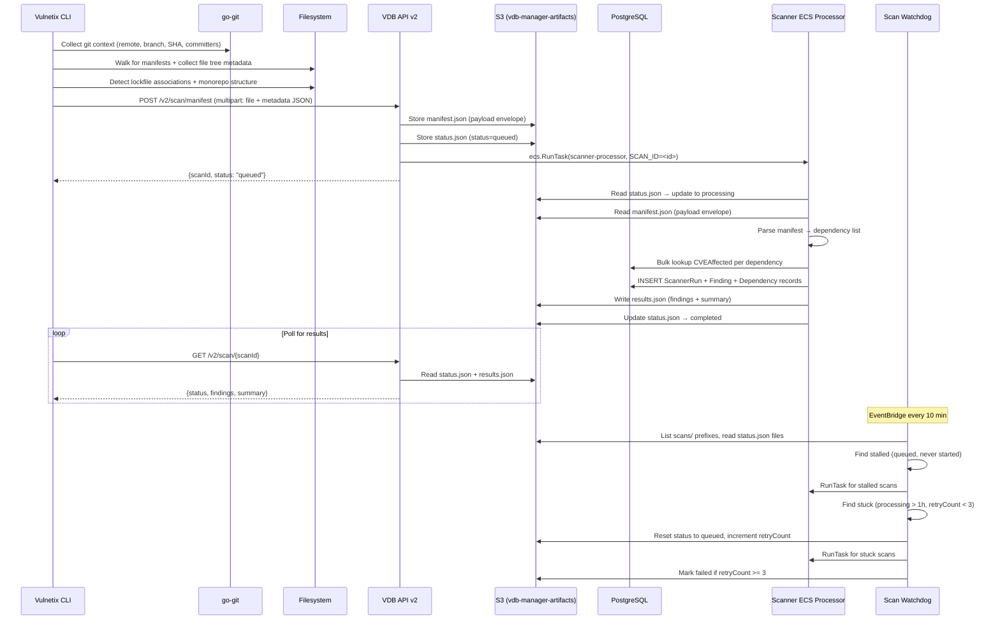
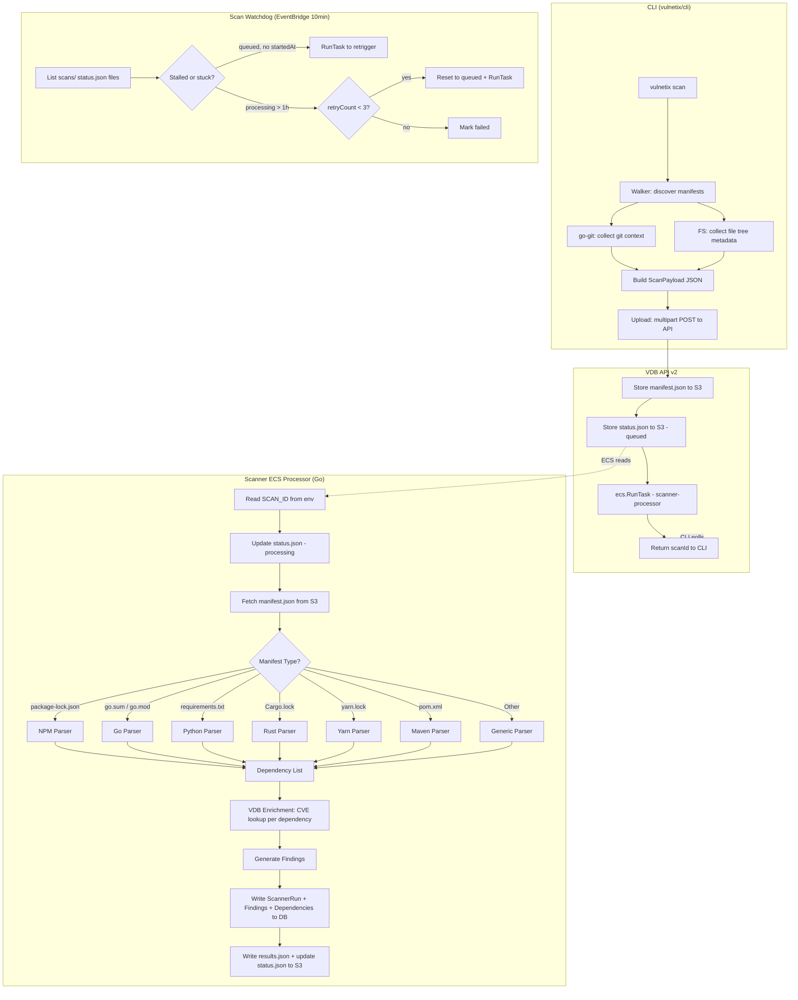

# Scanner ECS Task Architecture

## Overview

The scanner system processes SCA (Software Composition Analysis) manifest files across three layers:

1. **CLI** (vulnetix/cli) — discovers manifests, collects git and filesystem context, uploads to API
2. **VDB API** (vulnetix/vdb-api) — receives uploads, stores to S3, triggers ECS RunTask
3. **Scanner ECS Processor** (vulnetix/vdb-manager go-processors, Go) — parses manifests, enriches with vulnerability data, writes results to S3
4. **Scan Watchdog** (vulnetix/vdb-manager go-processors, Go) — EventBridge 10min, recovers stalled/stuck scans

The CLI acts as a **smart collector, dumb sender** — it gathers rich local context but does not parse dependencies. All dependency resolution and vulnerability matching happens server-side so parsers can be updated independently of CLI versions.

## End-to-End Sequence



## Data Flow



## CLI Preprocessing

### Git Context Collection (`internal/gitctx`)

New CLI package using `go-git/v5` to collect repository metadata without relying on CI environment variables. This works identically for local development and CI environments.

```go
type GitContext struct {
    RemoteURLs       []string        `json:"remoteUrls"`
    CurrentBranch    string          `json:"currentBranch"`
    CurrentCommit    string          `json:"currentCommit"`
    RecentCommitters []CommitterInfo `json:"recentCommitters"`
    RepoRootPath     string          `json:"repoRootPath"`
    IsDirty          bool            `json:"isDirty"`
}

type CommitterInfo struct {
    Name  string `json:"name"`
    Email string `json:"email"`
    Count int    `json:"count"`
}
```

**Collection strategy:**

| Data | Method |
|------|--------|
| Remote URLs | `repo.Remotes()` → list all fetch URLs |
| Branch | `repo.Head()` → reference name |
| Commit SHA | `repo.Head()` → hash |
| Committers | `repo.Log()` → last 50 commits → deduplicate by email |
| Dirty state | `worktree.Status()` → check for changes |
| Repo root | Walk up from scan path looking for `.git` |

**Graceful degradation:** If the scan path is not inside a git repository, `GitContext` is nil and the upload proceeds without it.

### File Tree Context (`internal/filetree`)

Collects SCA-relevant filesystem metadata that helps the server-side processor understand the project structure.

```go
type FileTreeContext struct {
    NodeModulesTree  []string          `json:"nodeModulesTree,omitempty"`
    GitignoreContent string            `json:"gitignoreContent,omitempty"`
    LockfileMap      map[string]string `json:"lockfileMap"`
    MonorepoInfo     *MonorepoInfo     `json:"monorepoInfo,omitempty"`
    ManifestRelPath  string            `json:"manifestRelPath"`
}

type MonorepoInfo struct {
    IsMonorepo     bool     `json:"isMonorepo"`
    WorkspaceType  string   `json:"workspaceType"`
    WorkspacePaths []string `json:"workspacePaths,omitempty"`
}
```

**node_modules tree:** Directory names only (not file contents), depth-limited to 2 levels, capped at 10,000 entries. Only collected for npm-ecosystem manifests.

**Lockfile association:**

| Manifest | Looks for |
|----------|-----------|
| `package.json` | `package-lock.json`, `yarn.lock`, `pnpm-lock.yaml` |
| `go.mod` | `go.sum` |
| `Cargo.toml` | `Cargo.lock` |
| `requirements.txt` | `Pipfile.lock`, `poetry.lock`, `uv.lock` |

**Monorepo detection:**

| Signal | Type |
|--------|------|
| `package.json` has `"workspaces"` | npm-workspaces |
| `pnpm-workspace.yaml` exists | pnpm-workspaces |
| `lerna.json` exists | lerna |
| `go.work` exists | go-work |
| `Cargo.toml` has `[workspace]` | cargo-workspace |

## ScanPayload JSON Specification

The CLI builds a `ScanPayload` JSON object sent as the `metadata` multipart form field alongside the raw manifest file.

```json
{
  "version": "1",
  "cli": {
    "version": "1.13.1",
    "platform": "linux/amd64"
  },
  "git": {
    "remoteUrls": ["https://github.com/org/repo.git"],
    "currentBranch": "main",
    "currentCommit": "abc123def456789",
    "recentCommitters": [
      {"name": "Dev", "email": "dev@example.com", "count": 12}
    ],
    "repoRootPath": "/home/user/project",
    "isDirty": false
  },
  "fileTree": {
    "nodeModulesTree": ["express/", "express/lib/", "lodash/"],
    "gitignoreContent": "node_modules/\n.env\ndist/\n",
    "lockfileMap": {
      "package.json": "package-lock.json"
    },
    "monorepoInfo": {
      "isMonorepo": true,
      "workspaceType": "npm-workspaces",
      "workspacePaths": ["packages/*", "apps/*"]
    },
    "manifestRelPath": "services/api/package-lock.json"
  },
  "ci": {
    "platform": "github",
    "repository": "org/repo",
    "sha": "abc123",
    "refName": "main"
  },
  "manifestType": "package-lock.json",
  "ecosystem": "npm",
  "timestamp": 1711234567890
}
```

**Backward compatibility:** The `metadata` field is optional. If absent, the ECS processor processes the manifest without git/filesystem context. Older CLI versions continue working unchanged.

## API Changes

### `POST /v2/scan/manifest`

**Current multipart fields:**

| Field | Type | Description |
|-------|------|-------------|
| `file` | binary | Raw manifest file |
| `type` | string | Manifest type (e.g., `package-lock.json`) |
| `ecosystem` | string | Package ecosystem (e.g., `npm`) |

**New optional field:**

| Field | Type | Description |
|-------|------|-------------|
| `metadata` | string (JSON) | `ScanPayload` JSON (git context, file tree, CI info) |

**Modified handler flow:**

```
1. Validate auth + rate limit
2. Parse multipart: file, type, ecosystem, metadata (optional)
3. Generate scanId (UUID)
4. Store S3: scans/{scanId}/manifest.json (payload envelope with manifest content + metadata)
5. Store S3: scans/{scanId}/status.json (status=queued, createdAt, depCount)
6. ecs.RunTask(scanner-processor, env: SCAN_ID=scanId)
7. Return {scanId, status: "queued", estimatedSeconds, pollUrl}
```

**IAM addition:** The API task role needs `ecs:RunTask` + `iam:PassRole` permissions.

### `GET /v2/scan/{scanId}`

Reads scan state from S3 (not from database or in-memory queue):

```
1. Read scans/{scanId}/status.json from S3
2. If not found → 404
3. If status = "completed" → also read scans/{scanId}/results.json
4. Return merged response (202 for queued/processing, 200 for completed/failed)
```

When `status = "completed"`, the response includes findings and summary from `results.json`:

```json
{
  "scanId": "uuid",
  "status": "complete",
  "manifestType": "package-lock.json",
  "ecosystem": "npm",
  "git": {
    "branch": "main",
    "commit": "abc123"
  },
  "summary": {
    "totalDependencies": 142,
    "totalVulnerabilities": 8,
    "malwareCount": 0,
    "critical": 1,
    "high": 3,
    "medium": 2,
    "low": 2
  },
  "vulnerabilities": [
    {
      "vulnId": "CVE-2024-1234",
      "packageName": "lodash",
      "version": "4.17.20",
      "severity": "high",
      "isMalicious": false,
      "scores": [
        {"type": "epss", "score": 0.234},
        {"type": "cvssv3.1", "score": 7.5}
      ]
    }
  ]
}
```

## ECS Processor Architecture

### Location (vdb-manager repo)

```
scripts/go-processors/
  cmd/scanner-processor/
    main.go         -- entry point: read SCAN_ID, S3 fetch, parse, scan, write results
  cmd/scan-watchdog/
    main.go         -- stalled/stuck job recovery, EventBridge triggered
  internal/manifest/
    types.go        -- ScanDependency, ScanFinding, ScanSummary, ScanStatus, ScanEnvelope, ScanResults
    parser.go       -- ParseManifestBytes() dispatcher + all 12 manifest parsers + SPDX/CycloneDX
```

### Processor Main Flow

```go
func main() {
    scanID := os.Getenv("SCAN_ID")
    if scanID == "" {
        log.Fatal("SCAN_ID environment variable required")
    }

    bucket := os.Getenv("S3_BUCKET_NAME")
    pool, _ := db.NewPool(ctx, db.EnvDatabaseURL(), db.EnvDatabaseURLRead())
    defer pool.Close()

    // 1. Update status.json → processing
    updateStatus(ctx, bucket, scanID, "processing")

    // 2. Fetch manifest.json from S3
    payload := fetchPayload(ctx, bucket, scanID)

    // 3. Parse manifest
    deps, ecosystem, _ := manifest.ParseManifest(payload.ManifestContent, payload.ManifestType, payload.Ecosystem)

    // 4. Scan dependencies (CVEAffected + CVEMetric + EpssScore + Kev)
    findings, summary := scanDependencies(ctx, pool.Read, deps, ecosystem)

    // 5. Write ScannerRun + Findings to DB
    createScannerRun(ctx, pool.Write, scanID, payload)
    storeFindings(ctx, pool.Write, scanID, findings, deps)

    // 6. Write results.json to S3
    storeResults(ctx, bucket, scanID, findings, summary)

    // 7. Update status.json → completed
    updateStatus(ctx, bucket, scanID, "completed")
}
```

### Manifest Parser API

The parsers use a function-dispatch pattern (not an interface) matching the vdb-api implementation. All 12 manifest types plus SPDX and CycloneDX are supported.

```go
// ParseManifestBytes parses manifest content and returns dependencies.
// Supported types: package.json, package-lock.json, requirements.txt, Pipfile.lock,
// go.sum, go.mod, Cargo.lock, Gemfile.lock, pom.xml, composer.lock, yarn.lock, pnpm-lock.yaml
func ParseManifestBytes(data []byte, manifestType, ecosystemOverride string) ([]ScanDependency, string, error)

// ParseSPDXDocument extracts dependencies from SPDX 2.3 JSON.
func ParseSPDXDocument(data []byte) ([]ScanDependency, error)

// ParseCycloneDXBOM extracts dependencies from CycloneDX BOM JSON.
func ParseCycloneDXBOM(data []byte) ([]ScanDependency, error)
```

Core types (`internal/manifest/types.go`):

```go
type ScanDependency struct {
    Name      string `json:"name"`
    Version   string `json:"version"`
    Ecosystem string `json:"ecosystem"`
    Purl      string `json:"purl,omitempty"`
}

type ScanVulnerability struct {
    CveId              string   `json:"cveId"`
    Severity           string   `json:"severity,omitempty"`
    CvssScore          *float64 `json:"cvssScore,omitempty"`
    EpssScore          *float64 `json:"epssScore,omitempty"`
    FixedVersion       string   `json:"fixedVersion,omitempty"`
    FixAvailability    string   `json:"fixAvailability"`
    InKev              bool     `json:"inKev"`
    RemediationPlanURL string   `json:"remediationPlanUrl"`
}

type ScanFinding struct {
    Dependency      ScanDependency      `json:"dependency"`
    Vulnerabilities []ScanVulnerability `json:"vulnerabilities"`
}

type ScanSummary struct {
    TotalDependencies      int            `json:"totalDependencies"`
    VulnerableDependencies int            `json:"vulnerableDependencies"`
    TotalVulnerabilities   int            `json:"totalVulnerabilities"`
    BySeverity             map[string]int `json:"bySeverity"`
    FixableCount           int            `json:"fixableCount"`
}

type ScanStatus struct {
    ScanId      string `json:"scanId"`
    Status      string `json:"status"`
    CreatedAt   string `json:"createdAt"`
    StartedAt   string `json:"startedAt,omitempty"`
    CompletedAt string `json:"completedAt,omitempty"`
    Error       string `json:"error,omitempty"`
    RetryCount  int    `json:"retryCount"`
    DepCount    int    `json:"depCount"`
}

type ScanEnvelope struct {
    ScanId          string `json:"scanId"`
    OrgId           string `json:"orgId"`
    ManifestType    string `json:"manifestType"`
    Ecosystem       string `json:"ecosystem"`
    ManifestContent string `json:"manifestContent"`
    Metadata        any    `json:"metadata,omitempty"`
}

type ScanResults struct {
    ScanId   string        `json:"scanId"`
    Summary  *ScanSummary  `json:"summary"`
    Findings []ScanFinding `json:"findings"`
}
```

### Vulnerability Enrichment

For each parsed dependency:

1. **Construct PURL**: `pkg:{ecosystem}/{name}@{version}`
2. **Query `CVEAffected`**: Match dependency name + ecosystem against affected version ranges
3. **Version comparison**: Compare dependency version against `lessThan`, `lessThanOrEqual`, specific affected versions (using ecosystem-appropriate semver)
4. **Fetch CVE metadata**: Join `CVEMetadata` for severity, description, EPSS, CVSS scores
5. **Create Finding**: With severity, scores, affected package, fix version (if available)

### Concurrency Model

The ECS task processes **exactly one scan** (identified by `SCAN_ID`). The API spawns one ECS task per scan submission. This is simpler than batch-and-drain because:

- No `FOR UPDATE SKIP LOCKED` contention
- Natural parallelism (multiple tasks run concurrently for multiple scans)
- Clear 1:1 mapping between API call and ECS task
- Task failures don't affect other scans

## Database Usage

Scan state (queued/processing/completed) is managed in S3, not the database. The database stores persistent vulnerability data only:

| Table | Usage | Key Fields |
|-------|-------|------------|
| `ScannerRun` | One per scan execution | `category='SCA'`, `toolName='vulnetix-scanner'` |
| `Finding` | One per vulnerability per dependency | `severity`, `vulnId`, `packageName` |
| `Dependency` | One per parsed package (upsert) | `name`, `version`, `ecosystem` |
| `Artifact` | S3 reference to uploaded manifest | `bucket`, `key`, `fileSize`, `contentType` |
| `CVEAffected` | Read-only: vulnerability-to-package mapping | `cveId`, `packageName`, `product` |
| `CVEMetric` | Read-only: CVSS scores | `cveId`, `baseScore`, `baseSeverity` |
| `EpssScore` | Read-only: EPSS scores | `cve`, `score` |
| `Kev` | Read-only: CISA KEV list | `cveID` |

### Suggested Fields on ScannerRun

```prisma
// CLI git context (not covered by existing GitHub-specific fields)
gitRemoteUrl    String?
gitBranch       String?
gitCommitSha    String?
manifestPath    String?
isMonorepo      Boolean? @default(false)
```

## S3 Storage

**Bucket:** `vdb-manager-artifacts` (existing)

**Key format:** `scans/{scanId}/` — three files per scan:

### `scans/{scanId}/manifest.json` — payload envelope

Written by the API on scan submission. Read by the ECS processor.

```json
{
  "scanId": "uuid",
  "orgId": "uuid",
  "manifestType": "package-lock.json",
  "ecosystem": "npm",
  "manifestContent": "... raw manifest file content ...",
  "metadata": { ... ScanPayload from CLI ... }
}
```

### `scans/{scanId}/status.json` — scan lifecycle state

Written by the API (queued), updated by the ECS processor (processing → completed/failed), and by the scan-watchdog (retry logic).

```json
{
  "scanId": "uuid",
  "status": "queued|processing|completed|failed",
  "createdAt": "2026-03-24T12:00:00Z",
  "startedAt": "2026-03-24T12:00:05Z",
  "completedAt": "2026-03-24T12:00:12Z",
  "error": "",
  "retryCount": 0,
  "depCount": 142
}
```

### `scans/{scanId}/results.json` — scan findings

Written by the ECS processor on completion. Read by the API on status poll.

```json
{
  "scanId": "uuid",
  "summary": {
    "totalDependencies": 142,
    "vulnerableDependencies": 8,
    "totalVulnerabilities": 12,
    "bySeverity": {"critical": 1, "high": 3, "medium": 5, "low": 3},
    "fixableCount": 7
  },
  "findings": [
    {
      "dependency": {"name": "lodash", "version": "4.17.20", "ecosystem": "npm"},
      "vulnerabilities": [
        {
          "cveId": "CVE-2024-1234",
          "severity": "high",
          "cvssScore": 7.5,
          "epssScore": 0.234,
          "fixedVersion": "4.17.21",
          "fixAvailability": "registry_available",
          "inKev": false,
          "remediationPlanUrl": "/v2/vuln/CVE-2024-1234/remediation-plan"
        }
      ]
    }
  ]
}
```

Large manifests (>10MB) are stored as-is — S3 handles up to 5GB per object. The ECS task (1GB memory) can parse manifests up to ~100MB comfortably.

## Scan Watchdog

A separate ECS task running on **EventBridge every 10 minutes** that recovers stalled and stuck scans.

### Location (vdb-manager repo)

```
scripts/go-processors/cmd/scan-watchdog/main.go
```

### Logic

```
1. List all scans/{scanId}/status.json files in S3
2. For each status.json:
   a. If status=queued AND no startedAt → stalled (RunTask never ran or failed to start)
      → Call ecs.RunTask(scanner-processor, SCAN_ID=scanId)
   b. If status=processing AND startedAt > STALE_TIMEOUT ago:
      - If retryCount < MAX_RETRIES → reset to queued, increment retryCount, RunTask
      - If retryCount >= MAX_RETRIES → mark as failed with "exceeded max retries"
3. Log all actions for CloudWatch monitoring
```

### Configuration

| Env Var | Default | Description |
|---------|---------|-------------|
| `SCAN_STALE_TIMEOUT_MINUTES` | `60` | Mark processing scans as stuck after this duration |
| `SCAN_MAX_RETRIES` | `3` | Max retrigger attempts before marking failed |
| `ECS_CLUSTER_ARN` | (required) | ECS cluster for RunTask |
| `ECS_TASK_DEF` | (required) | scanner-processor task definition family |
| `ECS_SUBNET_IDS` | (required) | Comma-separated subnet IDs for Fargate networking |
| `ECS_SECURITY_GROUP_IDS` | (required) | Comma-separated security group IDs |

### Terraform

Uses the existing `ecs-go-task` module with a 10-minute EventBridge schedule:

```hcl
module "scan_watchdog" {
  source              = "./modules/ecs-go-task"
  task_name           = "scan-watchdog"
  schedule_expression = "rate(10 minutes)"
  command             = ["/app/scan-watchdog"]
  cpu                 = 256
  memory              = 512
  environment = merge(local.go_task_environment, {
    ECS_CLUSTER_ARN            = aws_ecs_cluster.vdb.arn
    ECS_TASK_DEF               = aws_ecs_task_definition.scanner_processor.family
    ECS_SUBNET_IDS             = join(",", var.subnet_ids)
    ECS_SECURITY_GROUP_IDS     = aws_security_group.ecs_tasks.id
    SCAN_STALE_TIMEOUT_MINUTES = "60"
    SCAN_MAX_RETRIES           = "3"
  })
  # ... cluster, roles, networking ...
}
```

The watchdog needs `ecs:RunTask` + `iam:PassRole` permissions (shared via the existing `ecs_task` role used by all go-processors).

## Terraform Resources

All Terraform lives in the `vdb-manager` repo under `terraform/`. The scanner infrastructure is defined in `terraform/scanner-processor.tf`.

### Resources in `scanner-processor.tf`

| Resource | Type | Description |
|----------|------|-------------|
| `aws_ecs_task_definition.scanner_processor` | Task def | Fargate ARM64, 512 CPU, 1024 MB. No EventBridge schedule — triggered by API RunTask |
| `aws_cloudwatch_log_group.scanner_processor` | Log group | `/ecs/go-scanner-processor` |
| `module.scan_watchdog` | ecs-go-task module | `rate(10 minutes)` EventBridge schedule, 256 CPU, 512 MB |
| `aws_iam_role_policy.api_run_scanner` | IAM policy | `ecs:RunTask` + `iam:PassRole` on scanner-processor task def |

### API environment variables (`terraform/api.tf`)

Added to the vdb-api container definition:

| Var | Value |
|-----|-------|
| `ECS_CLUSTER_ARN` | `aws_ecs_cluster.vdb.arn` |
| `ECS_TASK_DEF` | `aws_ecs_task_definition.scanner_processor.family` |
| `ECS_SUBNET_IDS` | `join(",", var.subnet_ids)` |
| `ECS_SECURITY_GROUP_IDS` | `aws_security_group.ecs_tasks.id` |

### Container images (`Containerfile.go-processors`)

Two new build targets added to the multi-stage Containerfile:

| Target | Binary | Base |
|--------|--------|------|
| `scanner-processor` | `/app/scanner-processor` | scratch + certs |
| `scan-watchdog` | `/app/scan-watchdog` | scratch + certs |

Both cross-compiled to ARM64 with `CGO_ENABLED=0`, stripped with `-ldflags="-s -w"`, ~4MB final image.

## Preprocessing Boundary

| Responsibility | CLI | ECS Processor |
|---|---|---|
| Discover manifest files | Yes | - |
| Read raw manifest content | Yes | - (reads from S3) |
| Collect git context (go-git) | Yes | - |
| Collect file tree metadata | Yes | - |
| Detect monorepo structure | Yes | - |
| Parse manifest into dependencies | - | Yes |
| Resolve transitive dependencies | - | Yes |
| Vulnerability lookup per dependency | - | Yes |
| Generate Finding records | - | Yes |
| Create ScannerRun records | - | Yes |
| SSVC scoring/prioritization | - | Yes |

## Implementation Status

All components are implemented and pushed to their respective repos.

### CLI (vulnetix/cli)

| Component | File | Status |
|-----------|------|--------|
| Git context collection | `internal/gitctx/collector.go` | Deployed |
| File tree metadata | `internal/filetree/collector.go` | Deployed |
| Scan payload builder | `internal/scan/payload.go` | Deployed |
| Metadata in manifest upload | `internal/vdb/api_v2.go` (`V2ScanManifest`) | Deployed |
| Metadata in SPDX/CycloneDX upload | `internal/vdb/api_v2.go` (`V2ScanSPDX`, `V2ScanCycloneDX`) | Deployed |
| Upload engine threading | `internal/scan/upload.go`, `cmd/scan.go` | Deployed |
| TUI git context passthrough | `internal/tui/model.go` | Deployed |

### ECS Processors (vulnetix/vdb-manager go-processors)

| Component | File | Status |
|-----------|------|--------|
| Manifest parser (12 types + SPDX + CycloneDX) | `internal/manifest/parser.go` | Deployed |
| Scanner types | `internal/manifest/types.go` | Deployed |
| Scanner processor | `cmd/scanner-processor/main.go` | Deployed |
| Scan watchdog | `cmd/scan-watchdog/main.go` | Deployed |

### VDB API (vulnetix/vdb-api)

| Component | File | Status |
|-----------|------|--------|
| S3 Put method | `internal/handler/deps.go` (`S3Adapter.Put`) | Deployed |
| ECS RunTask client | `internal/handler/deps.go` (`RunScanTask`, `InitECSClient`) | Deployed |
| Scan handlers (S3 + RunTask) | `internal/handler/v2_scan.go` | Deployed |
| Scan status (reads S3) | `internal/handler/v2_scan.go` (`V2ScanStatus`) | Deployed |
| In-memory ScanQueue | `internal/handler/v2_scan_queue.go` | Removed |

### Terraform (vulnetix/vdb-manager terraform/)

| Component | File | Status |
|-----------|------|--------|
| Scanner processor task def | `terraform/scanner-processor.tf` | Deployed |
| Scan watchdog (rate 10min) | `terraform/scanner-processor.tf` | Deployed |
| IAM RunTask + PassRole | `terraform/scanner-processor.tf` | Deployed |
| API ECS env vars | `terraform/api.tf` | Deployed |
| Containerfile build stages | `Containerfile.go-processors` | Deployed |

### Future Work

- Transitive dependency chain tracking (`FindingIntroducedVia`)
- Monorepo-aware deduplication
- S3 lifecycle policy to expire `scans/` prefix after 30 days

## Risks and Mitigations

| Risk | Mitigation |
|------|-----------|
| Large manifests (10-50MB `package-lock.json`) | 1GB ECS memory, chunked DB writes (batch 500) |
| RunTask cold start latency (~30-60s Fargate) | Acceptable for async scan; CLI polls at 5s intervals |
| RunTask failures (capacity, out of ENIs) | Scan watchdog retriggers stalled jobs every 10 min, max 3 retries |
| ECS task crashes mid-processing | Watchdog detects stuck (processing > 1h) and retriggers with retry counter |
| Semver differences across ecosystems | Use ecosystem-specific version comparison (Go `semver`, npm ranges, Python PEP 440) |
| CLI backward compatibility | `metadata` field is optional; API parses manifest regardless |
| S3 scan data accumulation | Add S3 lifecycle rule to expire `scans/` prefix after 30 days |
